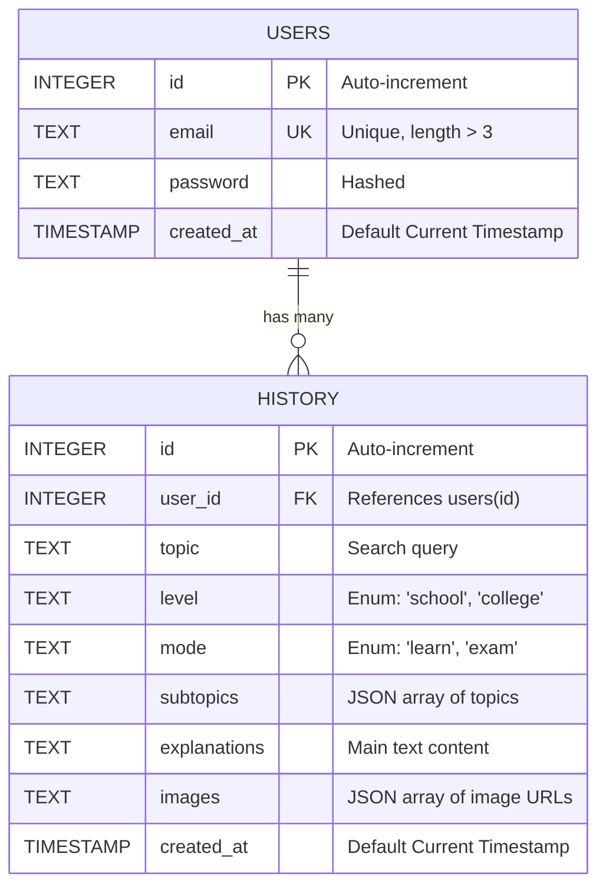

# AI-Powered Learning Platform Documentation

## 1. Project Overview
The AI-Powered Learning Platform is an intelligent educational application designed to simplify complex topics into understandable visual and textual content. It helps students, engineers, and general learners grasp difficult concepts quickly and effectively. By leveraging cutting-edge Generative AI for both text and image creation, the platform bridges the gap between curiosity and mastery by tailoring the output to the user's specific learning level (e.g., School vs. College) and mode (Learn vs. Exam).

## 2. Methodology & System Architecture

### 2.1 Technology Stack
- **Frontend**: React.js, React Router, Framer Motion (for physics-based text animations), Lucide React (for icons), and custom CSS (Vanilla CSS / Bootstrap) utilizing a high-end "Glassmorphism" dark-mode aesthetic.
- **WebGL Subsystem**: Three.js integrated via EffectComposer and UnrealBloomPass for the `TubesCursor` "Neural Ribbon" background effect.
- **Backend**: Python, Flask (Web Framework), SQLite3 (Relational Database).
- **AI Services**:
  - **Text Generation**: Google Gemini API (`gemini-2.5-flash-lite` or similar) is used to generate structured, leveled explanations and identify key subtopics.
  - **Image Generation**: Pollinations.ai is used as a dynamic image generation proxy to create context-aware educational diagrams and visuals based on the text context.

### 2.2 Core Workflow (Methodology)
1. **User Authentication**: Users securely sign up and log in. JWT (JSON Web Tokens) or session-based auth is handled by the Flask backend, storing user credentials securely in SQLite.
2. **Topic Submission**: From the dashboard, the user inputs a specific topic they wish to learn, selecting their academic level (`school` or `college`) and the context mode (`learn` or `exam`).
3. **AI Processing Pipeline**:
   - The React frontend sends a REST API request to the Flask backend.
   - **Step A (Text & Structure)**: The backend constructs a prompt based on the user's input and sends it to the **Gemini API**. Gemini returns a structured JSON payload containing the main explanation and an array of subtopics.
   - **Step B (Visual Prompts)**: The backend extracts keywords or visual contexts from the Gemini response and formats URL requests to **Pollinations.ai** to fetch real-time generated educational images.
4. **Data Persistence**: The generated content (topic, text, image URLs) is saved to the SQLite `history` table, linked to the specific user via a Foreign Key relation.
5. **Cinematic UI Rendering**: 
   - Initial load triggers a high-fidelity video sequence (`landing.mp4`) covering the DOM. Once ended, the main page is revealed using Framer Motion spring physics.
   - The user sees a split view of text explanations (subtopics) and a grid of AI-generated images. Clicking an image triggers a custom Lightbox popup for detailed viewing.

---

## 3. Database Schema

The database uses SQLite and is structured to handle user authentication alongside their generation history. 

### `users` Table
Stores user credentials and identity.
- `id`: INTEGER (Primary Key, Auto-increment)
- `email`: TEXT (Unique, Not Null, length > 3)
- `password`: TEXT (Not Null, typically hashed)
- `created_at`: TIMESTAMP (Default: Current Timestamp)

### `history` Table
Stores the payload generated by the AI for caching and user review purposes.
- `id`: INTEGER (Primary Key, Auto-increment)
- `user_id`: INTEGER (Foreign Key referencing `users(id)`)
- `topic`: TEXT (Not Null)
- `level`: TEXT (Not Null, restricted to 'school', 'college')
- `mode`: TEXT (Not Null, restricted to 'learn', 'exam')
- `subtopics`: TEXT (Not Null, stored as JSON string)
- `explanations`: TEXT (Not Null)
- `images`: TEXT (Not Null, stored as JSON string of URLs)
- `created_at`: TIMESTAMP (Default: Current Timestamp)

*Indexes are applied on `history(user_id, created_at DESC)` and `history(topic)` for optimized query performance when loading user dashboards.*

---

## 4. Entity-Relationship (ER) Diagram

## 5. Security & Optimization
- **Backend Validation**: Email length checks, Enum validation on `level` and `mode`.
- **CORS & Networking**: Configured in Flask `config.py` to only accept requests from allowed frontend origins. The frontend API (`api.js`) explicitly targets `127.0.0.1` instead of `localhost` to bypass modern browser IPv6 (`::1`) `ERR_CONNECTION_REFUSED` limitations.
- **Lazy Loading**: Images generated via Pollinations use `loading="lazy"` on the frontend to improve perceived performance.
- **Hardware Acceleration**: The cinematic `<video>` intro uses `transform: translateZ(0)` to force a dedicated GPU layer.
- **WebGL Render Pausing**: The `TubesCursor` explicitly listens for the video playback state via the `video-playing` body class. When active, the `requestAnimationFrame` loop skips `composer.render()`, freeing up 100% of the GPU for the video decoder to prevent lag and stuttering.
- **Rate Limiting/Fallbacks**: The frontend handles potential image generation failures via safe SVG fallbacks (e.g., `ImageCard.js` onerror logic).
